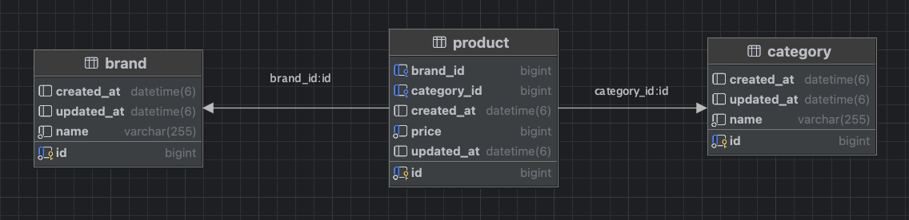
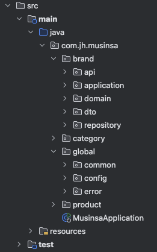
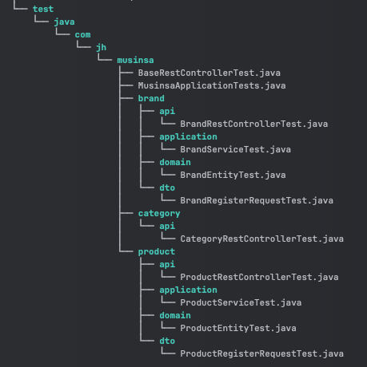

## Backend Engineer (세일개발팀) 과제 - 이주현

## 기술 스택
- Java 17, Spring Boot 3.3.3
- H2 Database, Spring Data JPA, QueryDSL
- Lombok, JUnit 5

## ERD



## 프로젝트 구조

- 프로젝트 패키지는 도메인(brand, category, product) 단위로 하위에 api, application, domain, dto, repository 등의 패키지와 전역(global) 패키지가 존재합니다.


- 테스트 코드는 크게 api, application, domain, dto 패키지 기반으로 작성하였습니다.
  - api: Controller Layer (Integration test)
  - application: Service Layer (Unit test)
  - domain: Entity (Unit test)
  - dto: Request validation


## 구현 방향
- 카테고리와 브랜드는 각각 N:M 연관 관계로 설정하였고, 그 중간 연관관계인 상품(Product) 테이블이 존재합니다. 

### 구현 1) 카테고리 별 최저가격 브랜드와 상품 가격, 총액을 조회하는 API
해당 API 구현은 [ProductRestController](src/main/java/com/jh/musinsa/product/api/ProductRestController.java) 에 존재합니다.
- 카테고리 별 최저 가격을 찾고, 그에 해당하는 브랜드, 상품, 카테고리 테이블을 통해 필요한 데이터를 조회합니다.
  - 특정 카테고리에서 최저가격이 복수개인 브랜드가 존재할 수 있기 때문에, 요구사항의 응답값과 동일하게 하나의 브랜드를 택하여 반환합니다.

### 구현 2) 단일 브랜드로 모든 카테고리 상품을 구매할 때 최저가격에 판매하는 브랜드와 카테고리의 상품가격, 총액을 조회하는 API
해당 API 구현은 [BrandRestController](src/main/java/com/jh/musinsa/brand/api/BrandRestController.java) 에 존재합니다.
- 브랜드 별 모든 카테고리 상품 총액의 최저가격 브랜드를 찾고, 이에 해당하는 브랜드명, 카테고리, 상품가격 등의 데이터를 조회합니다.

### 구현 3) 카테고리 이름으로 최저, 최고 가격 브랜드와 상품 가격을 조회하는 API
해당 API 구현은 [CategoryRestController](src/main/java/com/jh/musinsa/category/api/CategoryRestController.java) 에 존재합니다.
- 요청값에 해당하는 카테고리명 기준 최저, 최고 가격의 브랜드/상품 가격의 데이터를 각각 조회합니다.

### 구현 4) 브랜드 및 상품을 추가 / 업데이트 / 삭제하는 API
해당 API 구현은 [BrandRestController](src/main/java/com/jh/musinsa/brand/api/BrandRestController.java) 와 [ProductRestController](src/main/java/com/jh/musinsa/product/api/ProductRestController.java) 에 존재합니다.
- 추가 API 의 경우, 등록된 데이터의 id 값을 반환하고, 업데이트/삭제 API 는 따로 데이터를 반환하지 않습니다.

### global
- 클라이언트의 요청에 대한 응답값을 동일한 형식과 상세한 내용으로 반환할 수 있도록 Custom [ApiResult](src/main/java/com/jh/musinsa/global/common/api/ApiResult.java), [ApiError](src/main/java/com/jh/musinsa/global/common/api/ApiError.java) 클래스를 생성하여 사용합니다.
- 전역 예외 처리를 위한 [GlobalExceptionHandler](src/main/java/com/jh/musinsa/global/error/GlobalExceptionHandler.java) 클래스를 사용합니다.

## 개선 포인트
- API 의 성능 및 트래픽의 증감도에 따라 개선 포인트가 존재합니다.
  1. 예를 들어, 구현 1) 카테고리 별 최저가격 데이터를 조회하는 API에서 카테고리 별 최저 가격 및 브랜드를 캐싱하고, 데이터 업데이트 시 함께 갱신하는 방식으로 개선할 수 있습니다.
  2. 혹은 최저가격을 관리하는 별도의 테이블을 구축하고, 쿼리의 연산 없이 바로 응답 처리가 되도록 개선할 수 있습니다.
  3. datasource 설정 혹은 쿼리 튜닝 등의 작업 또한 고려해볼 수 있을 것 같습니다.
- 요구사항에 따라 브랜드명, 카테고리명 은 unique 로 관리가 필요할 수 있습니다. (+ 인덱스 설정)


## 실행 방법
1. CLI
```text
1. git clone https://github.com/juhyun-leee/musinsa.git
2. cd musinsa
3. ./gradlew build
4. ./gradlew bootRun
```

2. IDE (IntelliJ)
```text
1. git clone https://github.com/juhyun-leee/musinsa.git
2. cd musinsa
3. idea . (프로젝트 Open)
4. MusinsaApplication Run
```

## API 테스트 (http)
- API 테스트는 [test.http](http/test.http) 파일을 통해 진행할 수 있습니다.
- 데이터베이스의 경우 `http://localhost:8080/h2-console` 로 접속하여 확인할 수 있습니다.
    - Driver Class: org.h2.Driver
    - JDBC URL: jdbc:h2:mem:~/musinsa
    - User Name: sa
    - Password:

